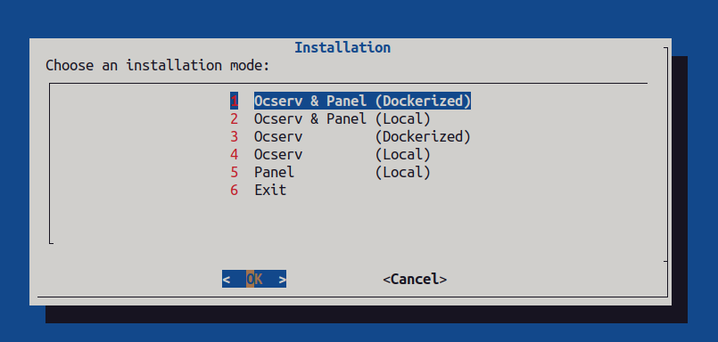

# ocserv-users-management 
### Web panel to manage ocserv and openconnect users
#### Requirements(Ubuntu 20.04 or Docker host)

#### features:
1- create an account with a limit of gigabytes or monthly usage

2- users: add, edit, update, remove, block and disconnect

3- group: add, edit, update and remove 

4- occtl command tools

5- statistics

6- Calculation of users' rx and tx


### Installation instructions
<center></center>

```
1- use install.sh script
    >>> chmod +x install.sh 
    >>> ./install.sh

2- Installing panel without script
    >>> chmod +x ./configs/panel.sh 
    >>> HOST=http://YOUR_DOMAIN_OR_IP ./configs/panel.sh

3- Docker host
    >>> DOCKER_SCAN_SUGGEST=false \
        DOMAIN=YOUR_DOMAIN \
        HOST=http://YOUR_DOMAIN_OR_IP \
        docker compose up -d --build

4- frontend developing
    >>> docker compose -f docker-compose.dev.yml up --build
```

